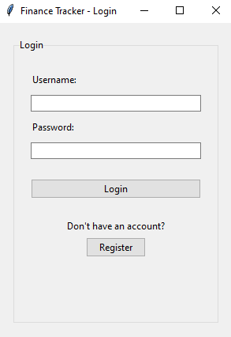
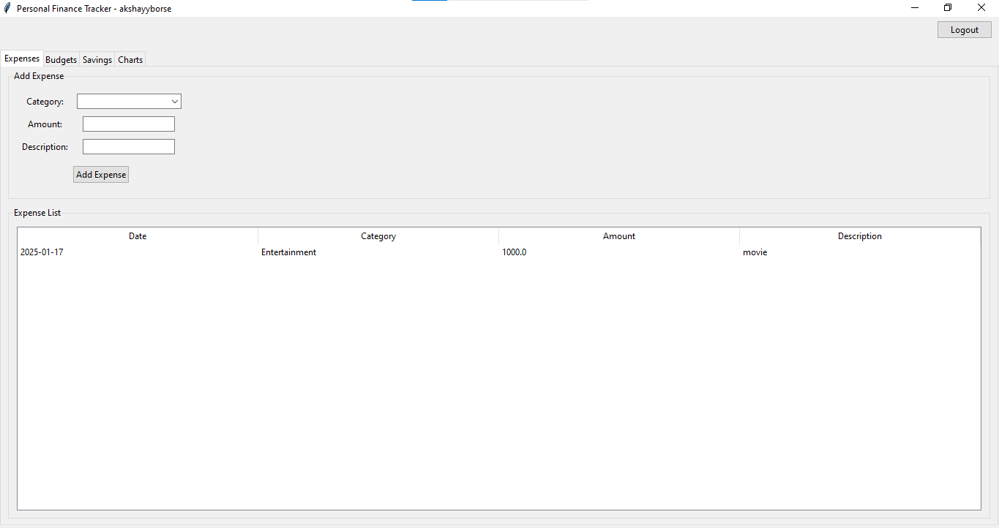
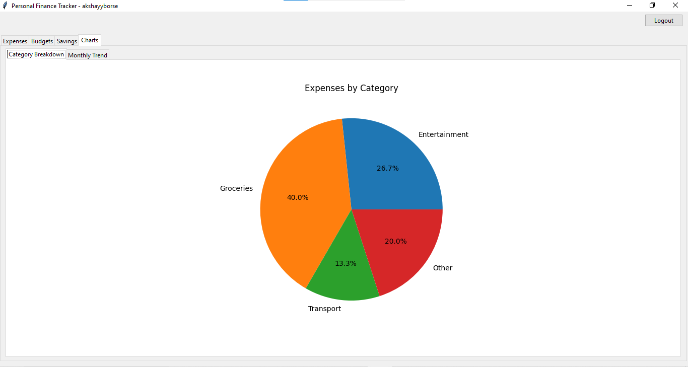

# Personal Finance Tracker

A Python desktop application for tracking personal finances, managing budgets, and monitoring savings goals. Built with Tkinter and SQLite for a simple, user-friendly experience.

## Features

- **Multi-User Support**
  - Secure login/registration system
  - Individual data tracking per user

- **Expense Management**
  - Add and track daily expenses
  - Categorize expenses (Groceries, Entertainment, etc.)
  - View expense history

- **Budget Control**
  - Set monthly/yearly budgets by category
  - Track spending against budgets
  - Real-time budget monitoring

- **Savings Goals**
  - Create and track savings targets
  - Monitor progress
  - Set target dates

- **Visual Analytics**
  - Expense breakdown pie chart
  - Monthly spending trends
  - Real-time chart updates

## Installation

1. **Prerequisites**
   - Python 3.8 or higher
   - Tkinter (usually comes with Python)

2. **Clone the repository**
   - git clone https://github.com/yourusername/finance-tracker.git
   - cd finance-tracker

3. **Install required packages**
   
4. **Additional steps for Linux users**
   bash
    sudo apt-get install python3-tk # For Ubuntu/Debian 
## Quick Start

1. **Run the application**
     
2. **Register a new account or login**

3. **Start tracking your finances!**
   - Add expenses in the Expenses tab
   - Set budgets in the Budget tab
   - Create savings goals in the Savings tab
   - View charts in the Charts tab

## Project Structure
finance-tracker/
├── main.py # Main application
├── database.py # Database operations
├── login_window.py # Login system
├── expense_tracker.py
├── budget_manager.py
├── savings_goals.py
├── charts.py
└── requirements.txt

## Dependencies
matplotlib==3.8.2
numpy==1.26.3
pillow==10.2.0
python-dateutil==2.8.2

## Screenshots

## Contributing

Contributions are welcome! Please feel free to submit a Pull Request.

## License

This project is licensed under the MIT License - see the [LICENSE](LICENSE) file for details.
